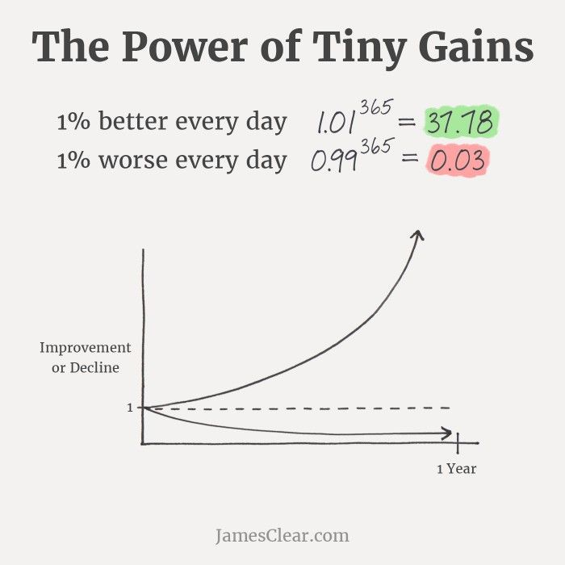
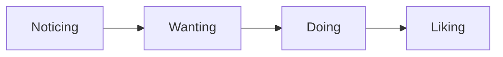
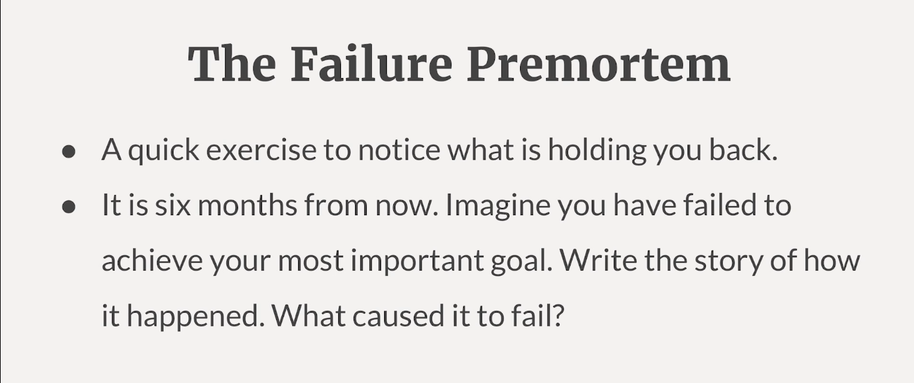
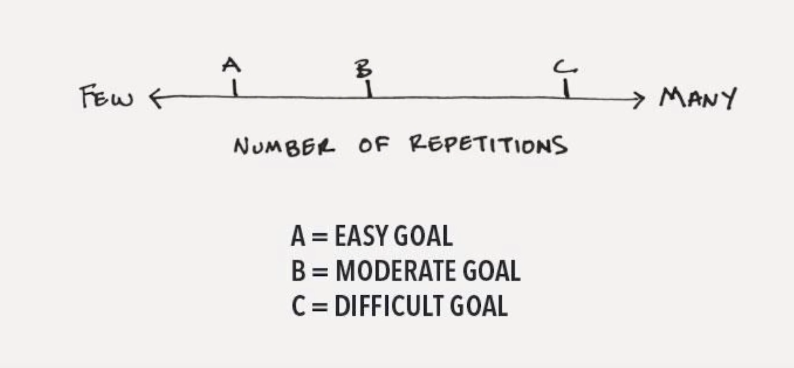
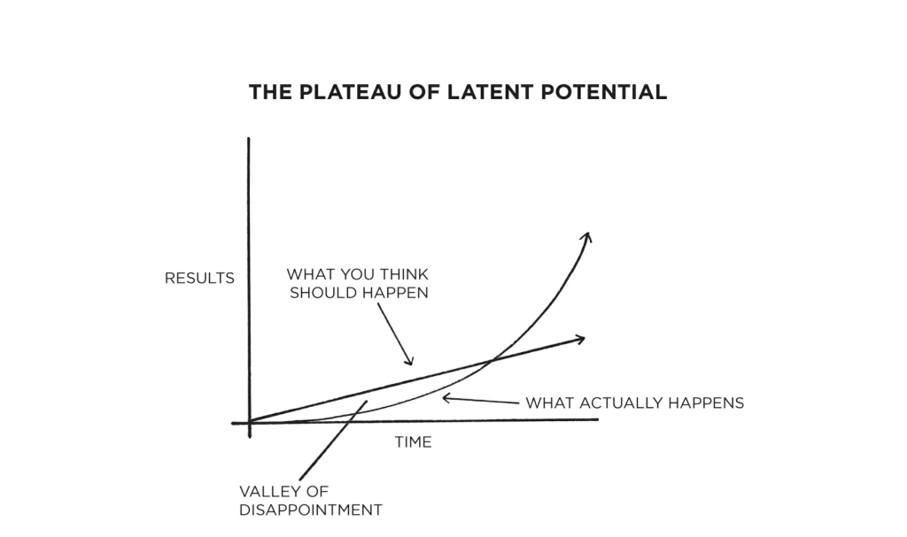

# Atomic Habits

## The Famous Graph

    
    
Difference over a year

## Speech
> [Atomic Habits: How to Get 1% Better Every Day - James Clear](https://www.youtube.com/watch?v=U_nzqnXWvSo)

- small habits and little choices are transforming us everyday 

### Four stages of habit transformation

#### Noticing
> Give your goals a time and place to live in the world.
- **Implementation Intentions**
    - many people think they lack motivation when they really lack is clarity
    - people think they need to get more motivated that they need willpower in order to execute on a habit, but they don't have a plan of execution
    - instead of feel whether you are motivated today, better to take decision-making out of this by setting a explicit plan of `when, where, how`.

- **Failure Premortem**

    

#### Wanting
> One of the most overlooked drivers of your habits is your physical environment.
- We tend to be the captive of our desire, we want things simply because they are an option
- Don't be the victim of your environment, be the architect of it
- It is extremely hard to consistently stick to positive habits in a negative environment

#### Doing
> Optimize for the starting line, not the finish line.
- In the beginning, the important thing is to just put your reps in and hone the skill
- Any outcome you want to achieve, it's just a point along the spectrum of repetitions

    

- Lots of time, people tend to focusing on the milestones and finish line, but forget to optimize the starting line and make it easy to get started, then outcome just come as a natural result

#### Liking
> The only reason we repeat behaviors is because we like them. You need to experience rewards along the way.

- We need to find a way to bring a rewards to the present moment
- For good habits, the immediate consequence is there, but the rewards are often delayed

    

- "[The best way to change long-term behavior is with short-term feedback](https://seths.blog/2014/08/short-term-long-term/)" by _[Seth Godin](https://www.google.com/search?client=firefox-b-d&q=seth+godin)_
- X marks on calendar, do it consecutively for days, then the only goal becomes don't break the chain

    

### Changing Identity
- We often fear, in order to achieve something new or to become someone new, we have to abandon everything that we are. But in fact changes happen gradually, with consistency and repetition, you can change not only your results, but actually your **Identity**.

> The more evidence we have to believe, the more likely we are to believe it. 

- Over the broad span of time, things that you do once of twice fade away, and things you do day in and day out accumulate the bulk of the evidence for what you believe about yourself.
- Every action you take, is a vote for the type of person you want to become. The more votes you cast, the more likely you are to win the election.
- **True change** is not behavior change, not result change, not process change, **is identity change**.

> The goal is not to read a book, it's to become a reader; the goal is not to write a book, it's to become a writer; the goal is not to run a marathon, it's to become a runner.

- The way of being something or becoming someone is through doing something

### Final Remark
Habits are not only the method through which we achieve external measures of success, they are also the path through which we achieve internal change and actually become someone new, they are the path through which we forge the identity we have and the deepest beliefs we have about ourselves.

**So if you can change your habits, you can change your life.**

## Book
### Four Laws
1. Make It Obvious
2. Make It Attractive
3. Make It Easy
4. Make It Satisfying

### 20 - The Downside of Creating Good Habits
> Habits create the foundation of Mastery.
- The benefits of habits come at a cost
    - you assume you are getting better and gaining experience
    - you fall into mindless repetition and let mistakes slide 
    - stop thinking about how to do it better
    - once a skill has been mastered, there is usually a slight decline in performance over time
- Combination of automatic habits and deliberate practice

    

- _"Once a habit has been mastered, you have to return to the effortful part of the work and begin building the next habit"_

    

- Habits are powerful, but you need a way to remain conscious of your performance over time
    - IDEA: provide users with weekly/monthly/annually review, track their performance as line graph
